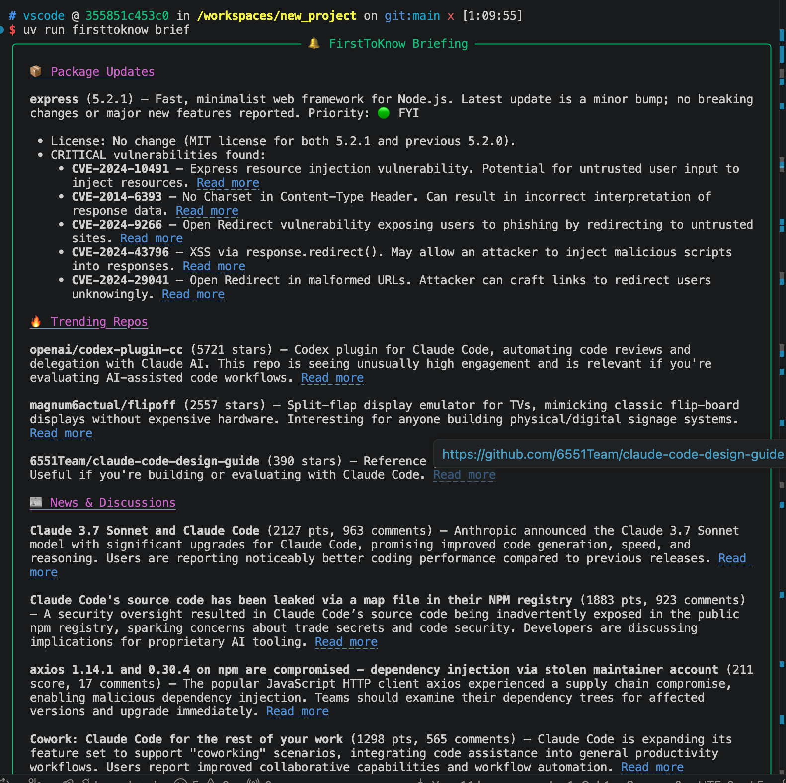

# 🔔 FirstToKnow

### Because being the first to know isn't luck — it's a system.

[](https://www.python.org/downloads/)
[]()
[](https://github.com/astral-sh/ruff)
[](https://github.com/astral-sh/uv)
[](https://opensource.org/licenses/MIT)

```
  ╔═╗╦╦═╗╔═╗╔╦╗╔╦╗╔═╗╦╔═╔╗╔╔═╗╦ ╦
  ╠╣ ║╠╦╝╚═╗ ║  ║ ║ ║╠╩╗║║║║ ║║║║
  ╚  ╩╩╚═╚═╝ ╩  ╩ ╚═╝╩ ╩╝╚╝╚═╝╚╩╝
  v0.4.0 — Never miss what matters in tech.
```

<p align="center">
  
</p>

<p align="center"><i>One command. Everything that matters about your stack — CVEs, breaking changes, trending repos, HN discussions.</i></p>

> **🔥 Real story caught by FirstToKnow:** The screenshot above is from an actual briefing — FirstToKnow surfaced that **Claude Code's source code was accidentally exposed via a `.map` file in their npm registry** (1,883 pts on HN) alongside **5 Express CVEs** and trending repos like `openai/codex-plugin-cc` — all in one command, before most developers even heard about it. That's the point.

---

## The Problem

You've been here:

- 😤 LiteLLM shipped a **breaking change** — you found out when your prod pipeline crashed
- 🤦 Google ADK released the exact fix you needed — **2 weeks ago**
- 😶 A repo with **15K stars** solves your exact problem — you never heard of it
- 🔓 A package you depend on has a **critical CVE** — you found out from Twitter, not your tooling
- 🫠 Your colleague casually drops *"oh yeah, that was deprecated last month"*

You're not lazy. You're not out of touch. **There's just too much happening and no one tool that watches YOUR stack.**

Dependabot bumps versions but doesn't explain why it matters. daily.dev shows generic news, not YOUR news. GitHub Watch drowns you in noise.

## The Fix

**FirstToKnow** is an AI agent that knows your stack, tracks what matters to YOU, and briefs you like a personal tech analyst.

```bash
# 30 seconds to set up
uv run firsttoknow scan                          # Auto-detects deps from your project
uv run firsttoknow track --topic "AI agents"     # Add topics you care about
uv run firsttoknow brief --model gpt-4o          # Get your personalized briefing
```

```
╭───────────────────────── 🔔 FirstToKnow Briefing ──────────────────────────╮
│                                                                            │
│  🔴 CRITICAL — action needed                                              │
│  ├── litellm 1.41.0 → Breaking: Azure auth flow changed                   │
│  ├── 🛡️ CVE-2024-1234 (HIGH 7.5) — SQL injection in litellm <1.40.5      │
│  └── google-adk 1.28.0 → New: Multi-agent orchestration                   │
│                                                                            │
│  🟡 WORTH KNOWING                                                         │
│  ├── 🔥 Trending: "hermes-agent" (15K ⭐ this week)                        │
│  └── HN: "AI agent memory" discussion (342 points)                        │
│                                                                            │
│  🟢 FYI                                                                   │
│  ├── pytest 9.0.2 — minor bugfixes                                        │
│  └── 3 new repos matching "AI agents" trending today                      │
│                                                                            │
╰──────────────────────────────── model: gpt-4o ─────────────────────────────╯
```

**No dashboards.** No browser tabs. No newsletters you'll never read. Just one command and you're the **first** to know.

## What makes it different

| Feature | FirstToKnow | Dependabot | daily.dev | GitHub Watch |
|---------|:-----------:|:----------:|:---------:|:------------:|
| Tracks YOUR stack | ✅ | ✅ | ❌ | ❌ |
| Explains what changed & why | ✅ | ❌ | ❌ | ❌ |
| CVE/vulnerability scanning | ✅ | ❌ | ❌ | ❌ |
| Trending repos & HN/Reddit | ✅ | ❌ | ✅ | ❌ |
| AI-prioritized (🔴 🟡 🟢) | ✅ | ❌ | ❌ | ❌ |
| Works with any LLM | ✅ | N/A | N/A | N/A |
| One command, full briefing | ✅ | ❌ | ❌ | ❌ |

## Features

### 📦 Package Tracking (PyPI + npm)
```bash
uv run firsttoknow track litellm                  # PyPI
uv run firsttoknow track --npm express             # npm
uv run firsttoknow scan                            # Auto-detect from pyproject.toml / package.json
```

### 🛡️ Security Vulnerability Scanning
Every tracked package is checked against [OSV.dev](https://osv.dev) (Google's vulnerability database) for known CVEs. Vulnerabilities are always flagged 🔴 CRITICAL with severity levels.

```
🔴 CVE-2024-1234 (CRITICAL 9.8) — Remote code execution via prompt injection
🔴 CVE-2024-5678 (HIGH 7.5) — SQL injection in query parameter handling
```

No auth required. No rate limits. Covers both PyPI and npm.

### ⏳ Live Progress Spinner
No frozen terminal. The briefing shows what's happening in real-time:

```
⠋ Checking PyPI...
⠙ Scanning for vulnerabilities...
⠹ Fetching GitHub trending repos...
⠸ Searching Hacker News...
⠼ Browsing Dev.to articles...
```

### 🎨 Rich Markdown Output
Briefings render with styled headings, **bold text**, bullet lists, and clickable terminal hyperlinks. Not raw markdown — actual formatted terminal output.

## Get Started in 60 Seconds

```bash
# Install
git clone https://github.com/dineshkrishna9999/firsttoknow.git
cd firsttoknow && uv sync

# Point it at any LLM (Azure, OpenAI, Gemini, Claude, Ollama)
echo "OPENAI_API_KEY=sk-..." > .env
uv run firsttoknow config model gpt-4o

# Tell it what you care about
uv run firsttoknow track litellm                  # PyPI package
uv run firsttoknow track --npm express            # npm package
uv run firsttoknow track --github BerriAI/litellm # GitHub repo
uv run firsttoknow track --topic "AI agents"      # Broad topic
uv run firsttoknow scan                           # Or just auto-detect everything

# Get briefed
uv run firsttoknow brief
```

That's it. You're the first to know.

## All Commands

```bash
# Track / Untrack
uv run firsttoknow track <name>                 # Track a PyPI package
uv run firsttoknow track --npm <name>           # Track an npm package
uv run firsttoknow track --github owner/repo    # Track a GitHub repo
uv run firsttoknow track --topic "AI agents"    # Track a topic
uv run firsttoknow track litellm --version 1.40 # Track with current version
uv run firsttoknow scan                         # Auto-detect from pyproject.toml / package.json
uv run firsttoknow untrack <name>               # Stop tracking

# Briefings
uv run firsttoknow brief                        # Get your AI briefing
uv run firsttoknow brief --model azure/gpt-4.1  # Use a specific model
uv run firsttoknow brief --raw                  # Raw text, no formatting

# Manage
uv run firsttoknow list                         # See what you're tracking
uv run firsttoknow status                       # Full overview
uv run firsttoknow config model <model>         # Set default LLM
uv run firsttoknow config show                  # Show settings
```

## Works With Any LLM

Powered by [LiteLLM](https://github.com/BerriAI/litellm) — so you're not locked in:

| Provider | Model | Env Var |
|----------|-------|---------|
| **Azure OpenAI** | `azure/gpt-4.1` | `AZURE_API_KEY` |
| **OpenAI** | `gpt-4o` | `OPENAI_API_KEY` |
| **Google Gemini** | `gemini/gemini-2.0-flash` | `GEMINI_API_KEY` |
| **Anthropic Claude** | `anthropic/claude-sonnet-4-20250514` | `ANTHROPIC_API_KEY` |
| **Ollama (free!)** | `ollama/llama3` | None needed |

## How It Works Under the Hood

```
You run: firsttoknow brief
              │
              ▼
   ┌─────────────────────┐
   │   FirstToKnow CLI   │  Reads your tracked items from ~/.firsttoknow/
   └──────────┬──────────┘
              │
              ▼
   ┌─────────────────────┐
   │    ADK Agent +      │  AI decides which tools to call based on
   │    LiteLLM          │  what you're tracking
   └──────────┬──────────┘
              │
     ┌────────┼────────┐
     ▼        ▼        ▼
  ┌──────┐ ┌──────┐ ┌──────┐
  │ PyPI │ │GitHub│ │  HN  │   Real API calls — not hallucinated data
  │  API │ │  API │ │ API  │
  └──────┘ └──────┘ └──────┘
  ┌──────┐ ┌──────┐ ┌──────┐
  │ npm  │ │Dev.to│ │Reddit│
  │  API │ │  API │ │ API  │
  └──────┘ └──────┘ └──────┘
  ┌──────┐
  │OSV   │  CVE/vulnerability scanning
  │(free)│
  └──────┘
              │
              ▼
   ┌─────────────────────┐
   │  AI synthesizes     │  Prioritizes: 🔴 Critical → 🟡 Important → 🟢 FYI
   │  and prioritizes    │  Thinks like a senior dev briefing a CTO
   └──────────┬──────────┘
              │
              ▼
   ┌─────────────────────┐
   │  Rich Markdown      │  Styled headings, bold, bullets, clickable links
   │  terminal output    │
   └─────────────────────┘
```

The AI **decides** which tools to call — you don't hardcode the flow. You just say "brief me" and it figures out what to check.

## Development

```bash
git clone https://github.com/dineshkrishna9999/firsttoknow.git
cd firsttoknow && uv sync

uv run poe check        # Run ALL checks (format, lint, typecheck, test)
uv run poe test         # Just tests
uv run poe fmt          # Format code
```

130 tests. Zero tolerance for regressions.

### Project Structure

```
src/firsttoknow/
├── cli.py              # CLI commands (Typer)
├── config.py           # Config & persistence (~/.firsttoknow/)
├── models.py           # Data models (TrackedItem, ItemType)
├── renderer.py         # Rich terminal output (Markdown, banners, spinners)
├── scanner.py          # Dependency scanner (pyproject.toml, requirements.txt, package.json)
└── agents/
    ├── agent.py        # ADK agent + runner (with tool-call callbacks)
    ├── _tools.py       # 7 API tools (PyPI, npm, GitHub, HN, Dev.to, Reddit, OSV)
    └── instructions/
        └── briefing.py # System prompt — the brain
```

## License

[MIT](LICENSE) — do whatever you want with it.

---

<p align="center">
  <b>Stop being the last to know. Start being the first.</b><br>
  <a href="https://github.com/dineshkrishna9999/firsttoknow">⭐ Star this repo</a> if you've ever found out about a breaking change from a colleague.
</p>
